# Dockerized File Server

This report documents the setup of a Dockerized Python file server and client.  
It covers the project directory structure, Docker configuration, server and client execution, example requests, and results.

---

## 1. Source Directory Content

The project is organized as follows:


**Screenshot:**  
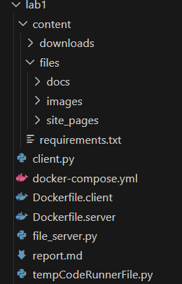

---

## 2. Docker Configuration

### docker-compose.yml
```yaml
 server:
    build:
      context: .
      dockerfile: Dockerfile.server
    container_name: web_server
    ports:
      - "8000:8000"
    networks:
      - webnet
    command: python file_server.py /app/content

  client:
    build:
      context: .
      dockerfile: Dockerfile.client
    container_name: web_client
    depends_on:
      - server
    networks:
      - webnet
    volumes:
      - ./content/downloads:/downloads
    stdin_open: true
    tty: true
    entrypoint: ["python", "client.py"]
```
### Dockerfile.server
```yaml
FROM python:3.11-slim
WORKDIR /app
COPY file_server.py .  
COPY content /app/content
EXPOSE 8000
CMD ["python", "file_server.py", "/app/content/files"]
```
### Dockerfile.client
```yaml
FROM python:3.11-slim
WORKDIR /app
COPY client.py .
CMD ["python", "client.py"]
```
## 3. Building and Starting the Containers
1. Move to the project directory: ```cd lab1```
2. Build the images: ```docker compose build```
3. Start the web_server container:  ```docker compose up -d server```
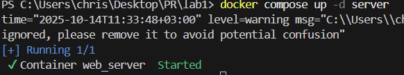


### Command that runs the server inside the container
The server container automatically runs this command on startup:
```python file_server.py files```
Here, files is the directory served by the HTTP server inside the container.

## 4. Requests Examples
1. HTML File (with image)
Access in browser: ```http://localhost:8000/files/site_pages/```
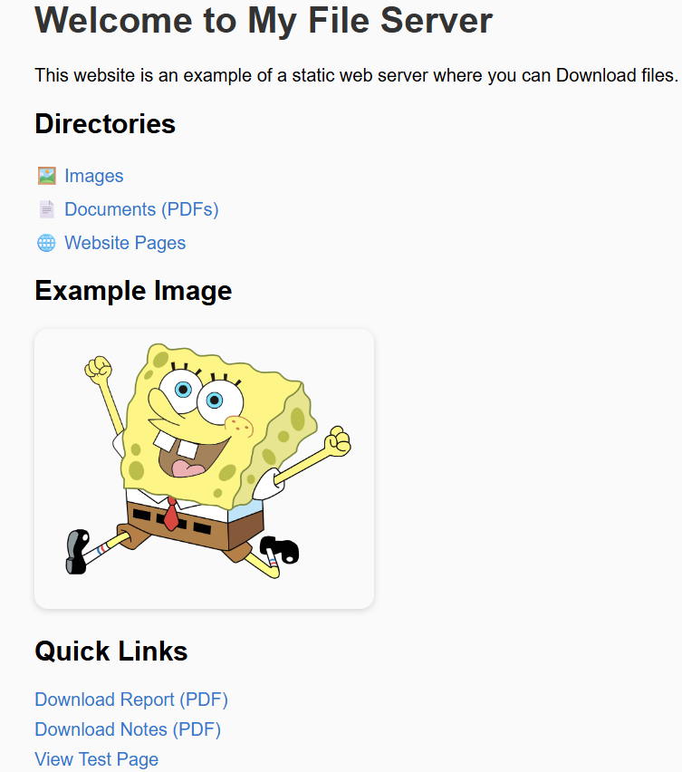

2. PDF File
Access: ```http://localhost:8000/files/docs/CaesarCipher.pdf```
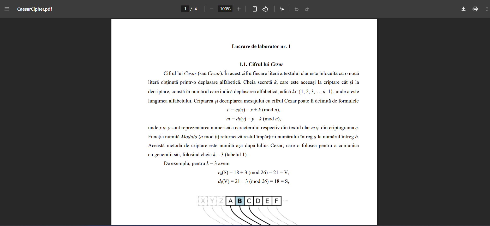

3. PNG File

Access: ```http://localhost:8000/files/images/spongebob1.png```

4. Inexistent File (404 Error)
Access: ```http://localhost:8000/missingfile.html```
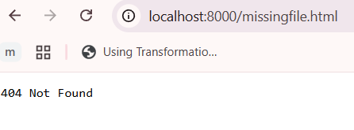

## 5. Client behaviour
To download a file from the server, you can run:
docker compose run client <server_host> <server_port> <url_path> <directory>
### Example: Downloading an image

1. docker compose run client server 8000 /files/images/spongebob1.png /downloads
2. server_host: server (the name of your server container in the Docker network)
3. server_port: 8000 (the port exposed by the server)
 url_path: /files/images/spongebob1.png (path to the file on the server)
 directory: /downloads (container path mapped to your local folder)

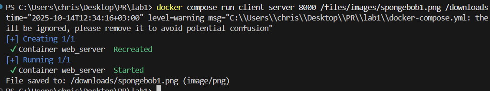

When you run the command, the client connects to the server and downloads the file. Example output:
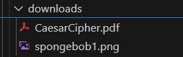

Any downloaded file will appear in: ./content/downloads
You can run multiple commands without rebuilding:
```docker compose run client server 8000 /files/docs/CaesarCipher.pdf /downloads```
```docker compose run client server 8000 /files/site_pages/test.html /downloads```

If the file is HTML, it will also print the content to the console:


## 6. Directory Listing (Subdirectories)
The directory `/app/content/files` (served by the server) contains:

- `/files/site_pages/` — HTML pages and related images  
- `/files/docs/` — PDF files  
- `/files/images/` — PNG images  
- `/files/` — other test files used for client downloads

If you just want to see the listing, access this link: http://localhost:8000/
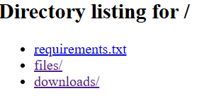
When accessing a directory without an index.html,
the server dynamically generates a listing.
 Example: ```http://localhost:8000/files/docs/```
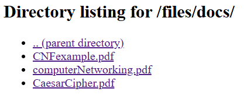

## 7. Browsing a Friend’s Server
For this part of the lab:
1. Both computers must be on the same LAN.
2. Get your friend’s IP address using: ipconfig
3. Look for "IPv4 Address"
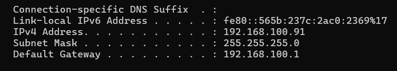
4. Access their server via: http://<friend_IP>:8000
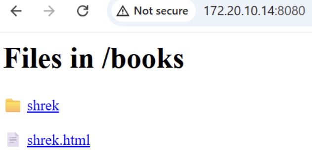
5. Use your client to download files: docker compose run clien  <friend_IP> <friend_port> /docs/CaesarCipher.pdf downloads
