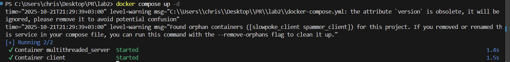
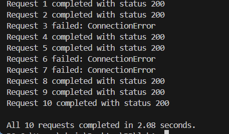
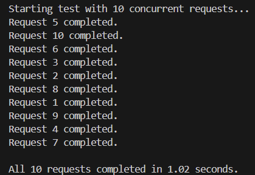
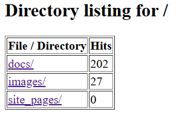
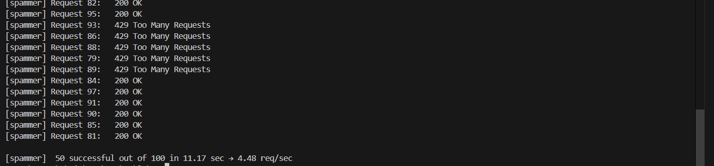
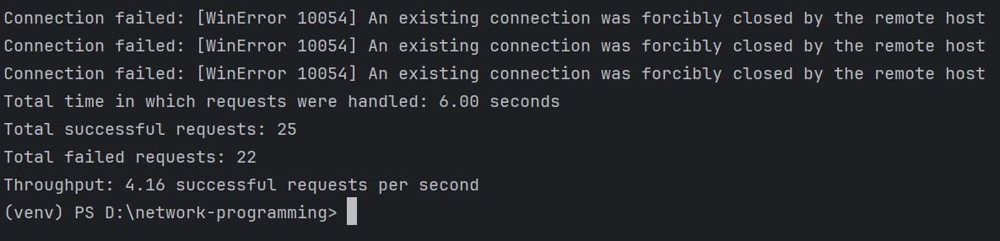
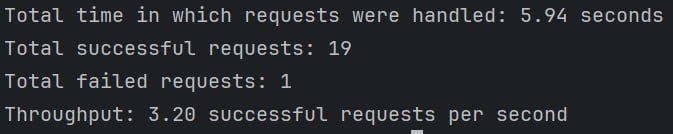
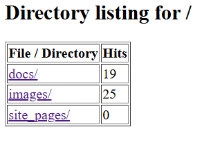

# Multithreaded HTTP Server with Concurrency

For this laboratory work, there is an extended HTTP server, which:
- Serve multiple clients concurrently using threads
- Count requests per file with race condition 
- Implement thread-safe rate limiting
- Test and compare the performance with different client behaviors

---

## 1. Source Directory Content

The project is organized as follows:
```
lab2
├── client.py       
├── web-server.py  
├── Dockerfile
├── docker-compose.yml
└── files/          
```
---

## 2. Docker Configuration

### docker-compose.yml
```yaml
server:
    container_name: multithreaded_server
    build:
      context: .
    command: python web-server.py files
    ports:
      - "8000:8000"
    networks:
      - labnet
    volumes:
      - ./files:/app/files

  client:
    container_name: client
    build:
      context: .
    networks:
      - labnet
    depends_on:
      - server
    entrypoint: ["sleep", "infinity"]
```


## 3. Building and Starting the Containers
1. Move to the project directory: ```cd lab2```
2. Build the images: ```docker compose build```
3. Start the web_server container:  ```docker compose up -d```
4. Start the client: ```docker exec -it client python client.py spammer/slowpoke```

I built the Docker image that contains the multithreaded server code and defined a service for it in the docker-compose.yml file. Then, I started the container using the command: ```docker compose up```



## 4. Multithreaded server

### Single threads



Observations:
1. The single-threaded server processes one request at a time. Others must wait for the socket to be free.
2. Since each request adds a 1-second delay, requests 2–10 wait in line.
3. Meanwhile, clients may time out or drop connections (especially if the client has a short timeout).


### Multithreading



Observations:
1. Using ThreadPoolExecutor with 10 workers allowed the server to handle all 10 client connections simultaneously, finishing in ~1 second.
2. Correct Use of ```time.sleep(1)``` Simulates Load

Therefore, for high-load or real-time systems, a threaded or asynchronous approach is essential.

## 5. Counter feature

1. Every time a file or directory is requested, the server increments a count in the request_counts dictionary (e.g., /test.html → 4 hits).
2. To avoid race conditions from concurrent threads, the counter update is protected with threading.Lock() when USE_LOCK = True.
3. When a client visits a folder (e.g., /), the server returns an HTML table showing the number of times each file/directory has been accessed.

```python
with counter_lock:
    request_counts[path] = request_counts.get(path, 0) + 1
```


## 6. Rate limiting

To prove rate limiting, 
1. When a client sends too many requests gets blocked 
2. A slower client stays under the limit and succeeds consistently

```python
if len(timestamps) >= RATE_LIMIT:
    send 429 Too Many Requests
```

###  Testing rate limiting

When I tested myself, first i called ```python client.py slowpoke``` and recieved this:



Observations:
- The client respects the rate limit (staying around ~5 req/sec).
- Only one request failed, likely due to timing jitter.
- The server handled requests smoothly without triggering rate-limiting blocks.

Then, i called ```python client.py spammer```


Observations:

- The client exceeded the rate limit, triggering HTTP ```429 Too Many Requests responses```.
- Half of the requests were rejected.
- The server enforced the per-IP limit effectively, even under heavy parallel request load.

Then, using the same LAN, I turned on the server and let other clients use it. Here are the responses:



Only half of requests have been completed.



Almost every request has been completed.

Also, the counter worked as intended:



Comparing to the results I obtained, the results from other clients are simmilar to mine.
Why?

- Each client (local or LAN) has its own IP. The server tracks request timestamps per client IP, so each one gets a separate 5 req/sec allowance.
- The ```rate_limits``` structure ```(a defaultdict(deque))``` is accessed with a Lock, ensuring correct behavior across multiple threads and clients.
- Since all clients are in the same LAN, latency and packet loss are negligible. This keeps results similar to local testing.
- Both slowpoke and spammer simulate consistent timing (fixed delay vs burst), which keeps behavior deterministic regardless of host.

Therefore, the multithreaded server works as intended: handles multiple requests in parallel, resolves race conditions in shared data using synchronization, and enforces rate limiting in a thread-safe way.