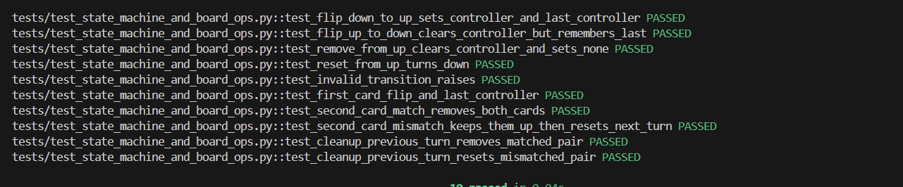
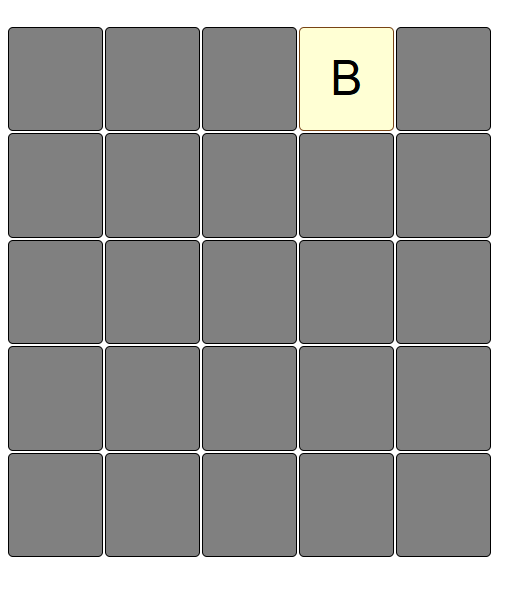
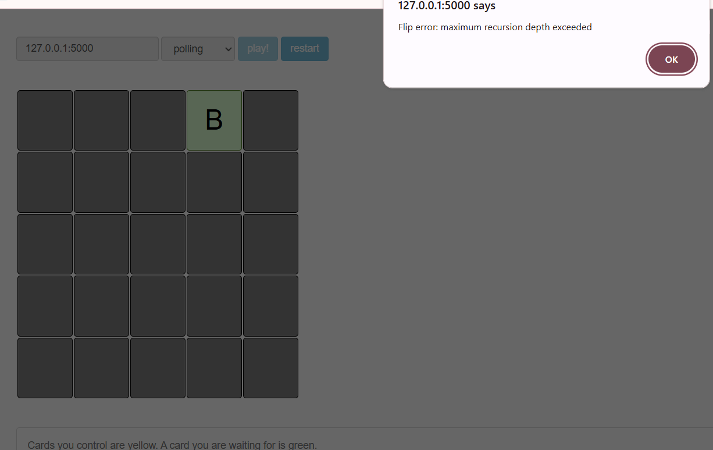
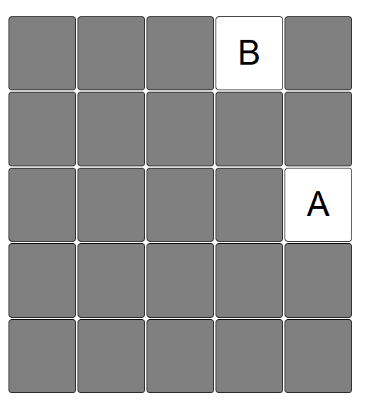
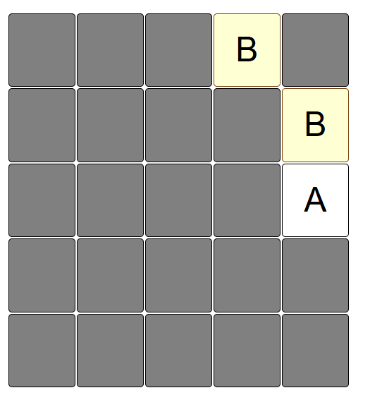
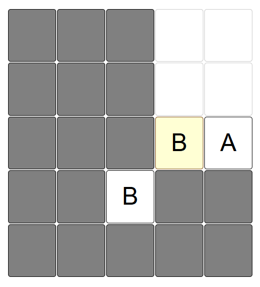
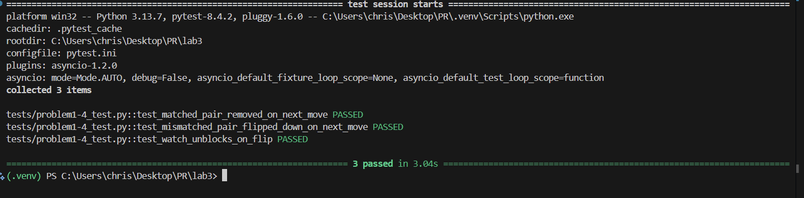
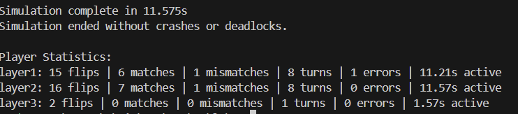
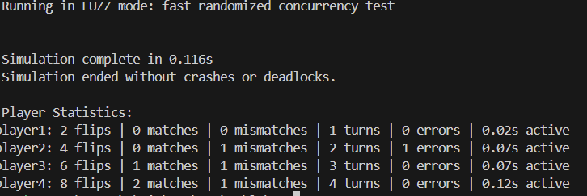
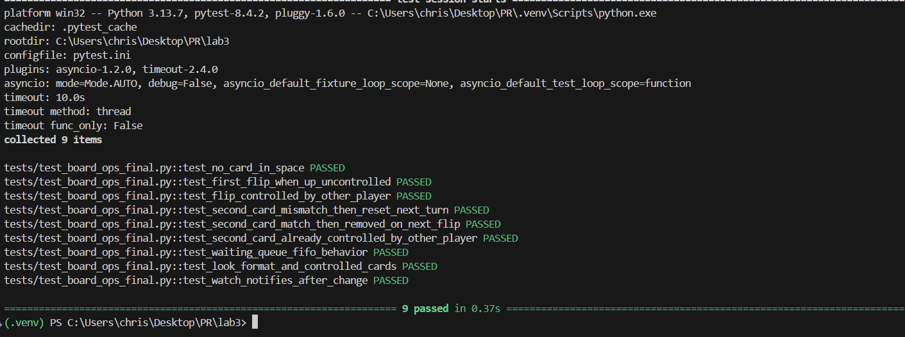

# Memory Scramble - Implementation Report

## Problem 1: Game Board

### Core ADTs
- **Board**: Mutable, concurrency-safe game board
- **_Card**: Internal card representation (value, state, controller)
- **CardStateMachine**: Handles state transitions (DOWN→UP, UP→NONE, etc.)

### Key Features
- `parseFromFile()` supports multiple formats (matrix, flat list, compact chars)
- Invariant validation with `BoardValidator`
- Per-card locking for concurrency control
- Player state tracking with pending operations



## Problem 2: Web Server

### HTTP Protocol

### Command Functions (`commands.py`)
- `look()`: Board visualization (2-line glue code)
- `flip()`: Card flipping with game rules (2-line glue code)
- Pure delegation to `BoardOps` - no additional logic

### Server Endpoints
- `GET /look/<player_id>` - Board state
- `GET /flip/<player_id>/<row>,<col>` - Flip attempts  
- `GET /replace/...` - Card transformation
- `GET /watch/<player_id>` - Change notifications
- `GET /restart` - Board reset

### Deployment
```bash
python -m src.server 5000 boards/ab.txt
```
- Multiplayer via browser tabs
- Automatic player ID generation
- Async Flask server with proper error handling

## Problem 3: Concurrent Players

### Fair Scheduling (`PriorityScheduler`)
- FIFO queues per card position
- `wait_for_turn()` for Rule 1-D waiting
- `release_card()` notifies next player
- Timeout handling prevents deadlocks

### Game Rules Implementation
**Rule 1 - First Card:**
- 1-A: No card → fail
- 1-B: Face-down → flip + control  
- 1-C: Face-up, not controlled → control
- 1-D: Face-up, controlled → **WAIT** in queue

**Rule 2 - Second Card:**
- 2-A: No card → fail + relinquish first
- 2-B: Controlled → **NO WAIT** + fail + relinquish first
- 2-C: Face-down → flip up
- 2-D: Match → keep both
- 2-E: No match → relinquish both

**Rule 3 - Previous Turn:**
- 3-A: Matched pair → remove from board
- 3-B: Non-matching → turn face down if conditions met













### Concurrency Safety
- Per-card locks for state transitions
- No circular dependencies
- Atomic queue operations
- Invariant preservation under load

### Simulation Testing
```python
await run_simulation(filename, players=4, tries=200)
```
- Visual and fuzz testing modes
- Concurrent access validation
- Deadlock and race condition detection 







## Problem 4: Card Transformation (`map`)

### Implementation
- `map()` applies async transformer to all cards
- Preserves card states and controllers
- Allows interleaving with other operations
- Maintains matching pair consistency


## Problem 5: Change Notification (`watch`)

### Implementation
- Waits for board changes (state transitions, removals, value changes)
- Non-changes: control changes, failed flips on empty spaces
- 0.5s timeout prevents indefinite blocking

### Notification System
- `_watchers` list of futures
- `_notify_watchers()` on relevant changes
- Atomic change grouping (pair removal = single change)
- Doesn't block other commands


## Testing Strategy

- **Unit Tests**: Parsing, state machines, schedulers
- **Integration**: Multi-player simulation
- **Stress**: High-concurrency fuzz testing
- **Validation**: Invariant preservation throughout

