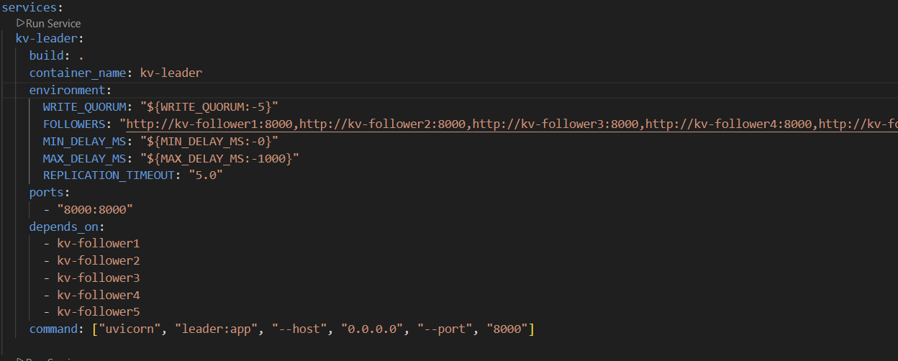
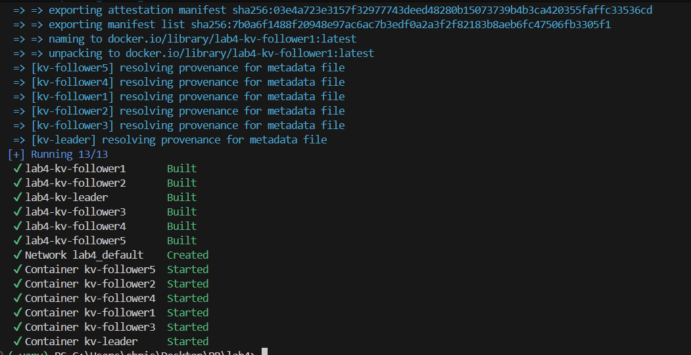
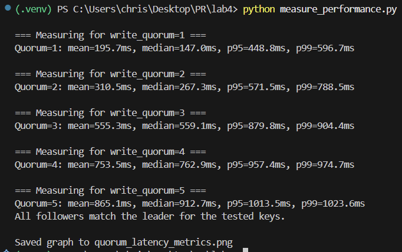
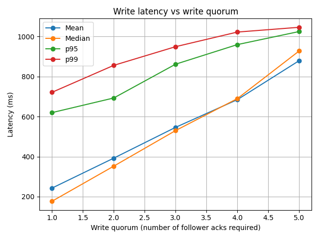

## Key-Value Store with Single-Leader Replication

### 1. System Setup

* **Docker Setup**: I used Docker Compose to deploy one leader and five followers, each running in separate containers. Communication between components is handled via a web API using JSON.
* **Write Quorum**: The `write_quorum` is configurable through environment variables in Docker Compose. It determines how many follower acknowledgments are required for a write to be considered successful.
* **Network Delay**: To simulate real-world network conditions, a random delay (ranging from 0ms to 1000ms) is introduced on the leader side before replicating writes to followers.




### 2. Results 

1. First, here's how to start the containers: ```docker-compose up --build -d ```



2. Then, run the performance test: ```python measure_performance.py```



* **Integration Test**: The system was tested by performing 100 concurrent writes (10 at a time) to 10 keys. The test ensured that data was correctly replicated to all followers and that the system behaved as expected under load.

* **Performance Measurement**: The performance was measured by varying the `write_quorum` from 1 to 5 and plotting the latency of the write operations. The goal was to observe the impact of the quorum on system latency.

### 3. Graph and Analysis

The following graph illustrates how the write latency changes as the `write_quorum` increases:

* **X-axis**: Represents the `write_quorum` (from 1 to 5), indicating how many followers must acknowledge a write before it’s considered successful.
* **Y-axis**: Represents the latency (in milliseconds) for each write operation.
* **Lines on the graph**:

  * **Mean**: The average latency.
  * **Median**: The middle value of the latency distribution.
  * **p95**: The 95th percentile latency, showing how long the slowest 5% of writes took.
  * **p99**: The 99th percentile latency, reflecting the slowest 1% of writes.



**Analysis**: As the quorum increases, the latency also increases. This is expected, as more acknowledgments from followers require more time for replication, especially with simulated network delays.

### 4. Data Consistency

After completing the writes, I checked the data on the followers to ensure consistency with the leader. The followers correctly replicated the data, confirming the system's eventual consistency.

### 5. Conclusion

* **Performance**: Higher write quorum values result in increased latency due to the additional replication required. This trade-off between consistency and performance is a key consideration when configuring quorum values.
* **Data Consistency**: The system ensured data consistency, with all replicas eventually matching the leader after all writes.


